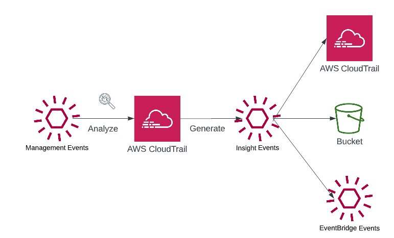
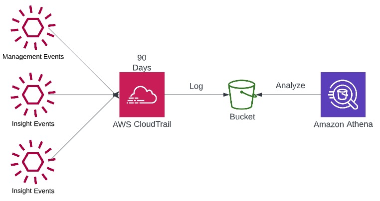

# Security

## CloudTrail

CloudTrail is the first place to examine when a resource is unexpectedly 
deleted or modified. The culprit is usually easy to spot.

- Provides governance, compliance, and audit for your AWS account.
- CloudTrail is enabled by default.
- A history of events and API calls made within your AWS account by
    - Console
    - SDK
    - CLI
    - Other AWS Services
- CloudTrail logs can be directed to CloudWatch or S3
- A CloudTrail trail can be applied to all regions (default behavior) or a single region

### CloudTrail Events

#### Management Events

- Operations that are performed on resources in your AWS Account
- For example,
    - Configuring security (IAM AttachRolePolicy)
    - Configuring rules for routing data (Amazon EC2 CreateSubnet)
    - Setting up logging (AWS CloudTrail CreateTrail)
- By default, trails are configured to log management events.

##### Event Types

###### Read Events
- Do not modify resources.
- An example is listing IAM users or all of the EC2 instance

###### Write Events
- May modify resources
- An example is attempting to delete a DynamoDb table

#### Data Events

- These tend to be high volume, and as such, are not enabled by default.
- These are also classified as either Read or Write event types.

##### Event Types

###### Read Events

- S3: GetObject
- Lamdba: function execution via the Invoke API
- DynamoDb: GetItem, BatchGetItem, Query, Scan, etc.

###### Write Events

- S3: PutObject, DeleteObject
- DynamoDB: CreateTable, DeleteTable, PutItem, BatchItemPut, etc.

### CloudTrail Insights

- CloudTrail Insights is a pay for usage service that is not enabled by default.
- Enabling CloudTrail Insights can help detect unusual activity in your account such as
    - Inaccurate resource provisioning
    - Bursts of IAM actions
    - Gaps in periodic maintenance activity
- CloudTrail Insights analyzes normal management traffic to create a baseline
- Continuosly analyzes write events to detect unusual patterns
    - Anomalies appear in the CloudTrail console
    - Event is sent to Amazon S3
    - An EventBridge event is generated (for automation needs)

### CloudTrail Events Retention
- Events are stored for 90 days in CloudTrail
- Long-term storage is possible by persisting logs in S3 and analyzing with Athena

## References

[DynamoDb API](https://docs.aws.amazon.com/amazondynamodb/latest/developerguide/HowItWorks.API.html)

[S3](https://docs.aws.amazon.com/AmazonS3/latest/API/API_Operations.html)
___

[Contents - Home](../../README.md)